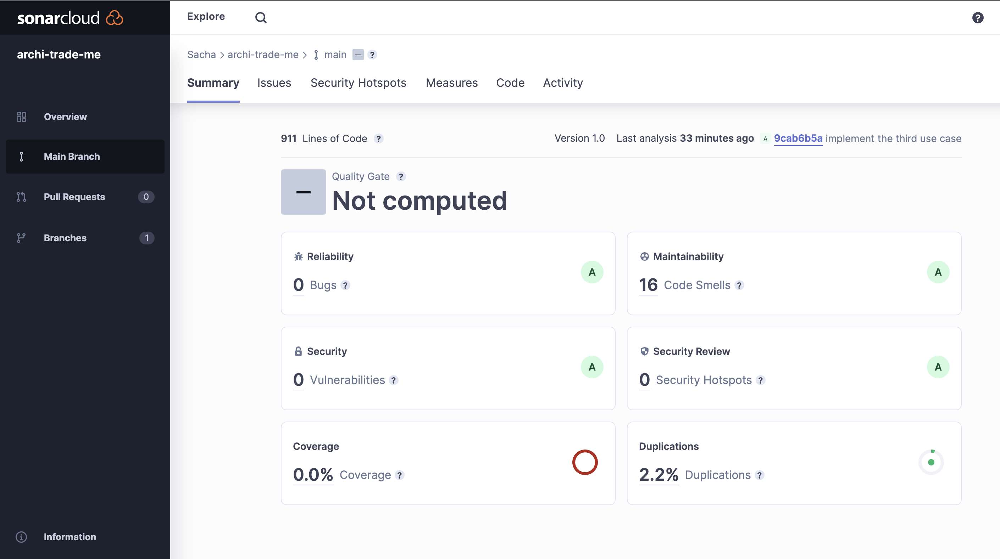

### ArchiTradeMe 🚀

***

#### ArchiTradeMe is a young startup wanting to launch its platform for connecting architect consultants and clients.

---

###

Created by "MOUCHON Sacha" & "MARLEIX Noé" for our 4TH year in Master of Software Architecture

---

## To run
> Run the database on docker by using `docker-compose up -d`.
>> and after you can hit in the termine `mvn spring-boot:run`.
---

